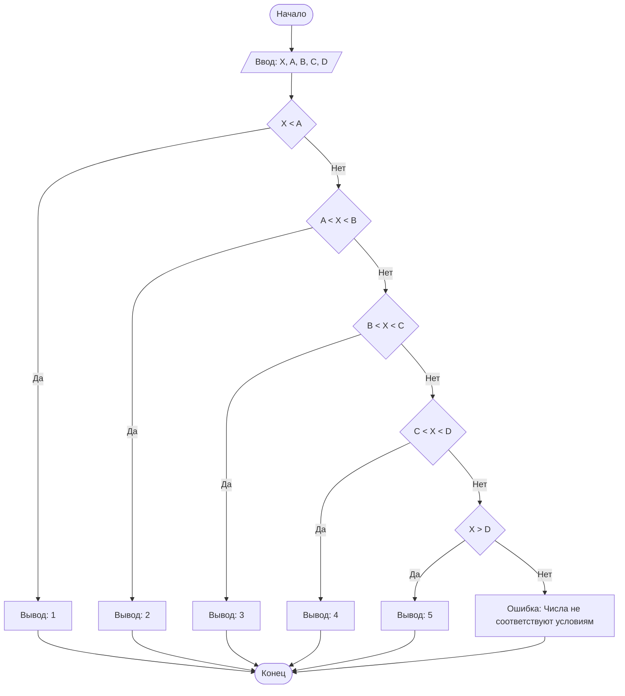

## Отчет по лабораторной работе № 1

#### № группы: `ПМ-2403`

#### Выполнил: `Карпенко Вадим Вадимович`

#### Вариант: `9`

### Cодержание:

- [Постановка задачи](#1-постановка-задачи)
- [Входные и выходные данные](#2-входные-и-выходные-данные)
- [Выбор структуры данных](#3-выбор-структуры-данных)
- [Алгоритм](#4-алгоритм)
- [Программа](#5-программа)
- [Анализ правильности решения](#6-анализ-правильности-решения)

### 1. Постановка задачи
> На числовой прямой находится два отрезка: [A, B] и [C, D]. Известно,
что все 4 точки (A, B, C, D) различны. Определить, как расположен отрезок [C,
D] относительно отрезка [A, B]. Варианты: строго левее (<), строго правее (>),
внутри (in), снаружи (out), слева и внутри (<=), справа и внутри (>=). На вход
программы подаются целые числа A, B, C, D.

Возможные варианты расположения включают:

- Строго левее (отрезок C, D полностью находится слева от A, B)
- Строго правее (отрезок C, D полностью находится справа от A, B)
- Внутри (отрезок C, D полностью находится в пределах A, B)
- Снаружи (отрезок C, D пересекает отрезок A, B и по обе стороны от него)
- Слева и внутри (отрезок C, D начинается слева и полностью входит в A, B)
- Справа и внутри (отрезок C, D заканчивается справа и полностью входит в A, B)

### 2. Входные и выходные данные
#### Данные на вход
- Четыре различных целых числа A, B, C и D. 

####Выходные данные:
- Строка, указывающая положение отрезка C, D относительно отрезка A, B
### 3. Выбор структуры данных
Для решения задачи подойдут простые целочисленные переменные. Будем использовать:
-	Переменные типа int для хранения входных данных X, A, B, C, D.
-	Присвоим участку, в который попадает X, номер от 1 до 5 и выведем этот номер.

### 4. Алгоритм
#### Алгоритм выполнения программы:
1. Ввести пять целых чисел: X, A ,B, C, D.
2. Проверить условия:
- Если X<A, то вывести 1 (участок 1).
-	Если A<X<B, то вывести 2 (участок 2).
-	Если B<X<C, то вывести 3 (участок 3).
-	Если C<X<D, то вывести 4 (участок 4).
-	Если X>D, то вывести 5 (участок 5).
3.  Завершить программу.
 	
#### Блок-схема

### 5. Программа
```java
import java.util.Scanner;

public class Main {
    public static void main(String[] args) {
        // Создаем сканер для считывания входных данных
        Scanner scanner = new Scanner(System.in);

        // Вводим данные
        int X = scanner.nextInt();
        int A = scanner.nextInt();
        int B = scanner.nextInt();
        int C = scanner.nextInt();
        int D = scanner.nextInt();

        // Логика проверки положения точки X
        if (X < A) {
            System.out.println(1); // Участок 1
        } else if (X < B && X > A) {
            System.out.println(2); // Участок 2
        } else if (X < C && X > B) {
            System.out.println(3); // Участок 3
        } else if (X < D && X > C) {
            System.out.println(4); // Участок 4
        } else if (X > D) {
            System.out.println(5); // Участок 5
        } else {
            System.out.println("Введённые числа не соответсвуют условиям задачи, они должны быть различны");
        }

        // Закрываем сканер
        scanner.close();
    }
}


```
### 6. Анализ правильности решения
Программа работает корректно на всем множестве решений с учетом ограничений.
1. Тест на `X = 4, A = 1, B = 3, C = 5, D = 7 `:

    - **Input**:
        ```
        4 1 3 5 7
        ```

    - **Output**:
        ```
        3
        ```

2. Тест на `X = 0, A = 2, B = 4, C = 6, D = 8 `:

    - **Input**:
        ```
        0 2 4 6 8
        ```

    - **Output**:
        ```
        1
        ```
 3. Тест на `X = 9, A = 1, B = 3, C = 5, D = 7 `:

    - **Input**:
        ```
        9 1 3 5 7
        ```

    - **Output**:
        ```
        5
        ```
4. Тест на ограничение задачи `X = 4, A = 1, B = 3, C = 4, D = 7 `:
   
    - **Input**:
        ```
        4 1 3 4 7
        ```

    - **Output**:
        ```
        Введённые числа не соответсвуют условиям задачи, они должны быть различны
        ```
   
